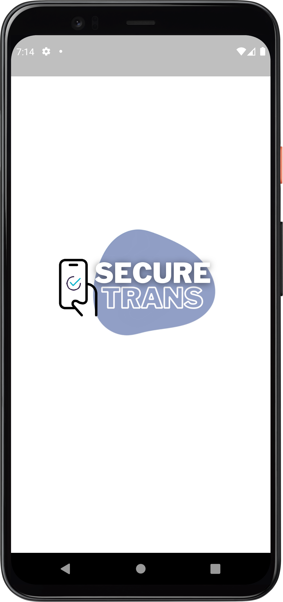
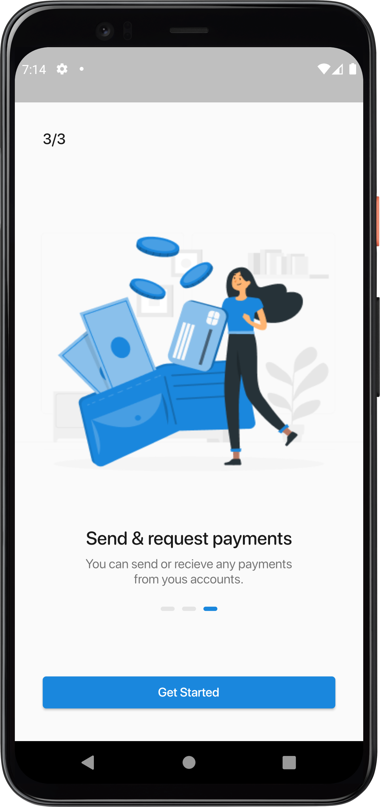
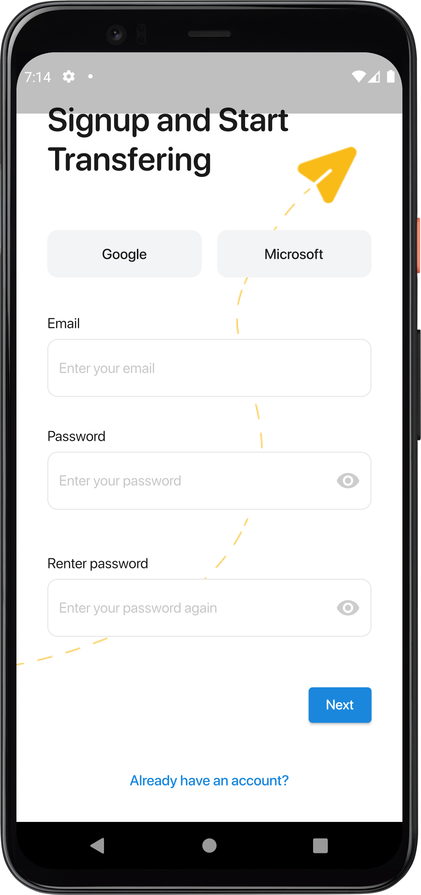
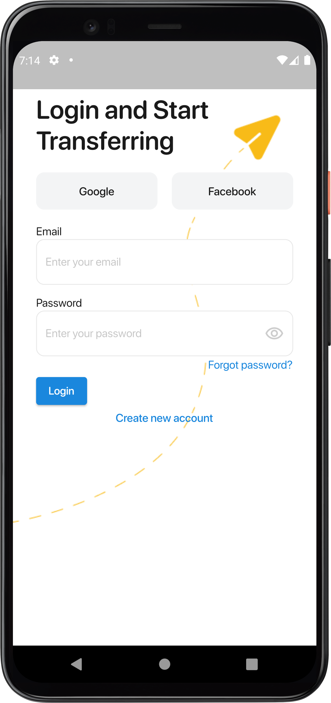
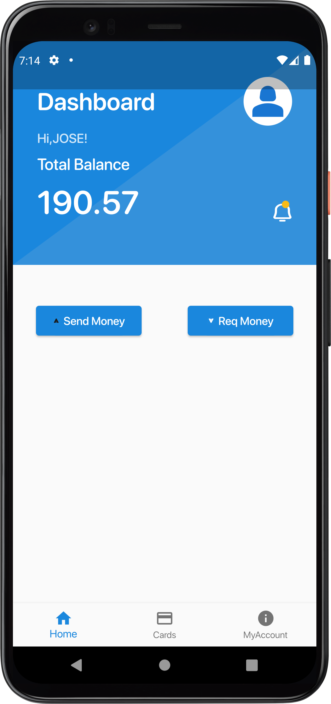
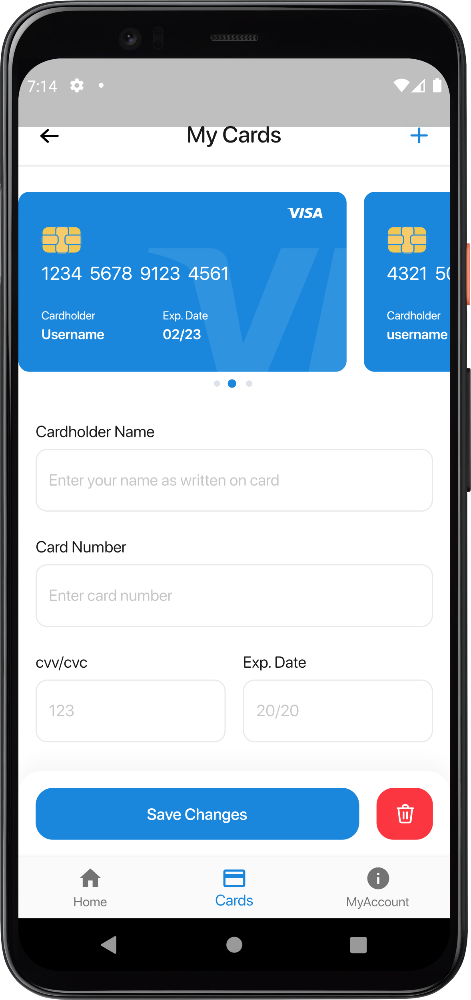
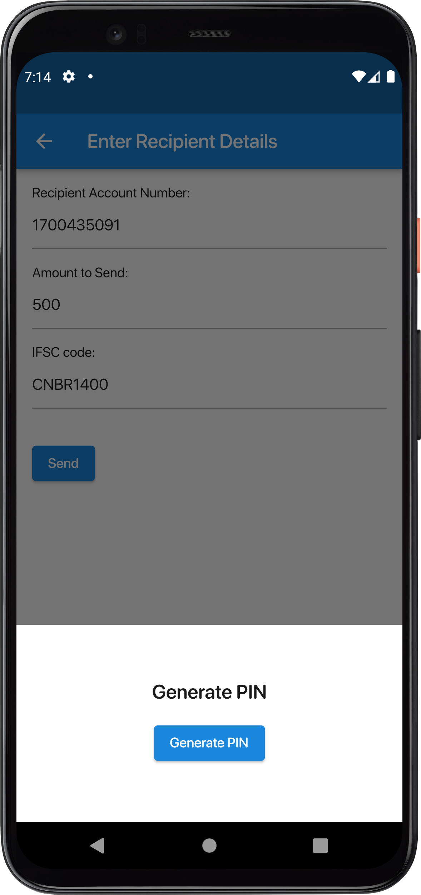
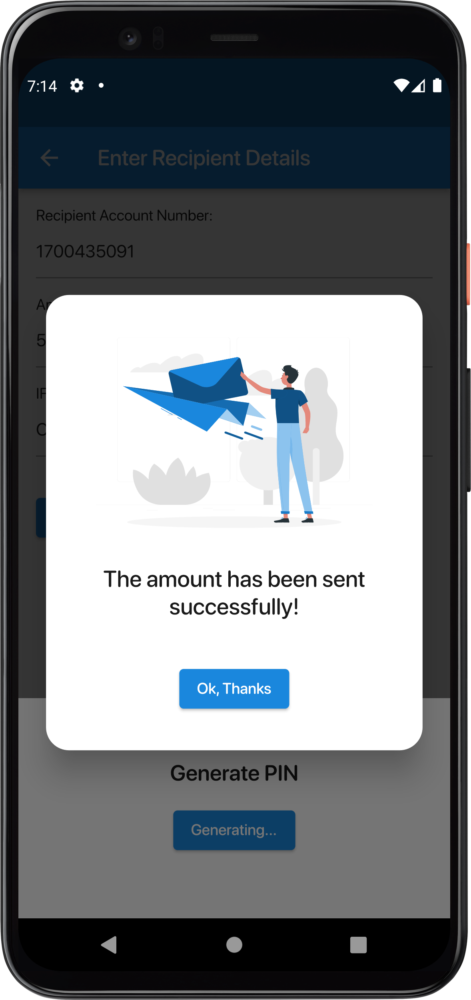

# SecureTrans

SecureTrans is a payment application designed to enhance security during transactions. It employs the principles of cellular automata to generate a unique dynamic PIN for each transaction. This PIN is generated independently on both the bank's side and the user's side, utilizing the same cellular automata algorithm. To ensure a successful transaction, the PINs generated by both parties must match.

Built using Flutter and Dart, SecureTrans provides a seamless and user-friendly experience across various platforms. Flutter's versatility enables efficient code sharing and rapid development, resulting in a smooth payment process for users. 

The application leverages Firebase as the backend infrastructure, offering reliable and scalable services. Firebase ensures real-time updates and secure data storage, enabling fast and secure transaction processing. 

With SecureTrans, users can enjoy the convenience of making payments while maintaining a high level of security. By incorporating cellular automata principles and utilizing the power of Flutter, Dart, and Firebase, this application provides a robust and secure solution for digital transactions.
E-Wallet App  

-------------  

  
  
  
  
  
  
  
  
  
  

-------------  

## Screens  
- Splash Screen  
- Onboarding Screens
- Login Screen
- Signup Screen
- Home Screen 
- Transactions Screen
- Profile Screen
- Send Money Screen
- Request Money Screen
- Info Screen
- My Cards Screen
- Add Card Scree
- Settings Screen
